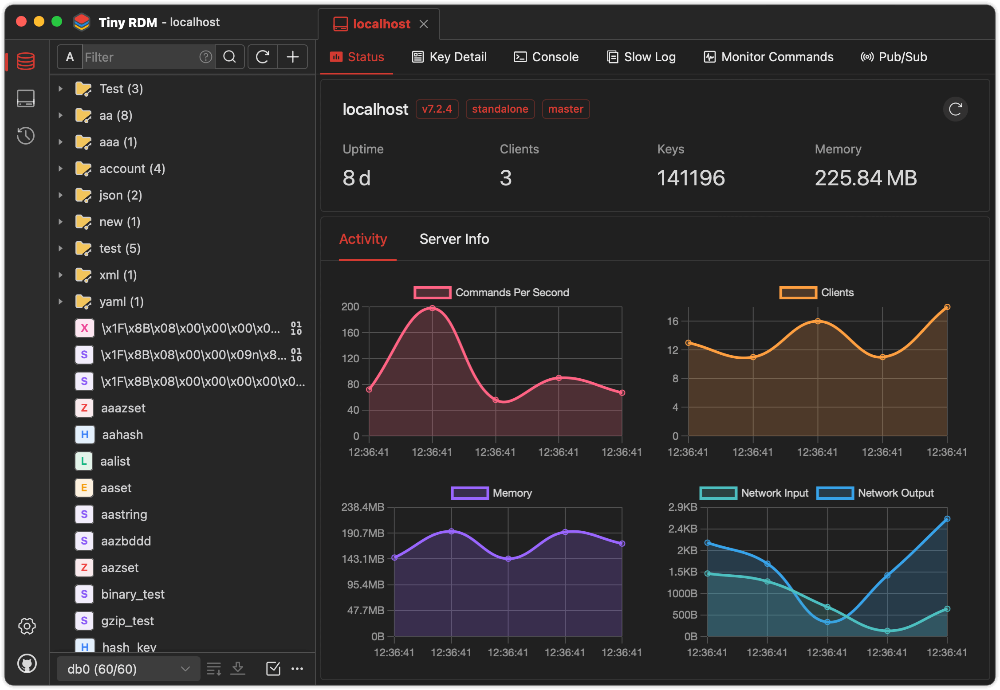

<div align="center">
<a href="https://github.com/tiny-craft/tiny-rdm/"></a>
</div>
<h1 align="center">KT</h1>
<h4 align="center"><strong>English</strong> | <a href="https://github.com/tiny-craft/tiny-rdm/blob/main/README_zh.md">
简体中文</a></h4>
<div align="center">

[](https://github.com/tiny-craft/tiny-rdm/blob/main/LICENSE)
[](https://github.com/tiny-craft/tiny-rdm/releases)

[](https://github.com/tiny-craft/tiny-rdm/stargazers)
[](https://github.com/tiny-craft/tiny-rdm/fork)
[](https://discord.gg/VTFbBMGjWh)
[](https://twitter.com/Lykin53448)

<strong>A lightweight, user-friendly and cross-platform k8s diagnosing tool.</strong>

</div>

<picture>
 <source media="(prefers-color-scheme: dark)" srcset="screenshots/dark_en.png">
 <source media="(prefers-color-scheme: light)" srcset="screenshots/light_en.png">
 
</picture>

<picture>
 <source media="(prefers-color-scheme: dark)" srcset="screenshots/dark_en2.png">
 <source media="(prefers-color-scheme: light)" srcset="screenshots/light_en2.png">
 
</picture>

## Feature

- Super lightweight, built on Webview2, without embedded browsers (Thanks
  to [Wails](https://github.com/wailsapp/wails)).
- Provides visually and user-friendly UI, light and dark themes (Thanks to [Naive UI](https://github.com/tusen-ai/naive-ui)
  and [IconPark](https://iconpark.oceanengine.com)).
- Multi-language support ([Need more languages ? Click here to contribute](.github/CONTRIBUTING.md)).
- Better connection management: supports SSH Tunnel/SSL/Sentinel Mode/Cluster Mode/HTTP proxy/SOCKS5 proxy.
- Visualize key value operations, CRUD support for Lists, Hashes, Strings, Sets, Sorted Sets, and Streams.
- Support multiple data viewing format and decode/decompression methods.
- Use SCAN for segmented loading, making it easy to list millions of keys.
- Logs list for command operation history.
- Provides command-line mode.
- Provides slow logs list.
- Segmented loading and querying for List/Hash/Set/Sorted Set.
- Provide value decode/decompression for List/Hash/Set/Sorted Set.
- Integrate with Monaco Editor
- Support real-time commands monitoring.
- Support import/export data.
- Support publish/subscribe.
- Support import/export connection profile.
- Custom data encoder and decoder for value display ([Here are the instructions](https://redis.tinycraft.cc/guide/custom-decoder/)).

## Installation

Available to download for free from [here](https://github.com/tiny-craft/tiny-rdm/releases).

> If you can't open it after installation on macOS, exec the following command then reopen:
>
> ```shell
>  sudo xattr -d com.apple.quarantine /Applications/Tiny\ RDM.app
> ```

## Build Guidelines

### Prerequisites

- Go (latest version)
- Node.js >= 16
- NPM >= 9

### Install Wails

```bash
go install github.com/wailsapp/wails/v2/cmd/wails@latest
```

### Pull the Code

```bash
git clone https://github.com/tiny-craft/tiny-rdm --depth=1
```

### Build Frontend

```bash
npm install --prefix ./frontend
```

or

```bash
cd frontend
npm install
```

### Compile and Run

```bash
wails dev
```

## About

### Wechat Official Account


### Sponsor

If this project helpful for you, feel free to buy me a cup of coffee ☕️.

- Wechat Sponsor


Cli Tab
// Ok, let's change it a bit, I login in the terminal when I switch to the Console tab, like what it did in @ContentCli.vue for now
// I want to seperate the frontend of gotty from backend, and move it into the @ContentCli.vue, user can operate cmd in the terminal.
// let's do it step by step
// - 1 init connnection, @terminal_service.go is responsible for manage all connections, if connecion is build ok, save connection info to sqilte3,include port, address, cmd, start_time
// - manage connection, every connnection will be alive for 2 hours, there is a job for maintain the all the connections, how to support reconnection
// - From frontend perspective, every time need to start a new session with info includes: address,port,writable,cmd
// - Backend start a gotty server with info sent by frontend
// - Cmd:
// - if create session from Console tab, cdebug to the default worker pod
// - if coming from item of diagnose tab
// - pod
// - running container: connect to it directly
// - failed container: return tlsConfig, nil

// ai client
// In preference ai options, check user ai condfiguration using like `func (c *OllamaClient) Configure(config IAIConfig) error {}`
// the available models in the chat is original from configured models in Preference ai options

- is there is not configured model, pop up preferences dialog to enable one
// save the configuration to preference.yaml, reload it to map of ai/client_service.go when KT reboot, map goes like `map[string]ai.IAI`, key goes like `provider-model`
//
todo:
- load and configure saved ai models when bootup app for ai client(async loadPreference)
- validate and cache all supported ai model providers when saving prefernece at PreferenceDialog
- sync validated ai model providers to chat input's model options


Let's combine the two components @ContentErrorPane.vue and @CliBar.vue together, here is the thing:
- when I click btn debugWithAI, the @CliBar.vue will popup from bottom to the half height of the tab pane
- The clicked item's info will sent as  init prompt to the chat box
- After the response msg is received, there are 2 options(Copy and Apply) can be shown up at the top right of the msg box when the mouse is hoved on any place on the response msg box, I can copy it and paste to the right terminal to be executed. And I can also click Apply btn to execute the command in the response box in the right terminal
- The popuped CliBar is draggable, and can be closed by clicking the close button on the top right of the CliBar, and when it's displayed, the data-table in @ContentErrorPane.vue is also visible(include the pagination on the bottom right), I can opreate it normally

Let's continue to implement @CliBar.vue 's functionality:
- I want the content of the chat box and the terminal can be keeped, when I swith back from others tab to current tab, so that I can continue to operate in the chat and terminal with previous context


### CliBar:

#### Issue:
- the current context of chat and terminal disappeared when switch back from others tab to current tab
- Run button is not working(feat/cli-bar-run-btn)
- the input can't be fixed in the bottom of chat container 


!-- 
cdebug exec --namespace=test -it --privileged --image=nixery.dev/shell/vim/ps/tshark/kubectl/zsh pod/my-distroless

-->
